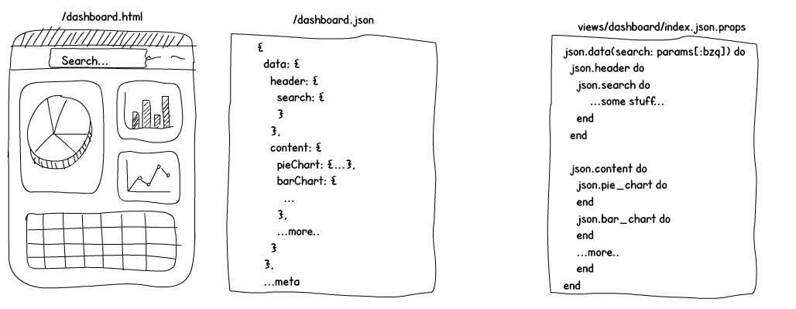
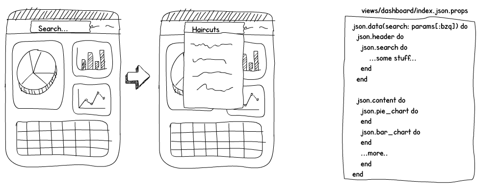

# Breezy

Use classic Rails to build rich React Redux applications with **NO APIs** and
**NO client-side routing**.

[](https://circleci.com/gh/jho406/Breezy)

Breezy is a prebuilt and customizable React Redux application inspired by
Turbolinks and designed to compliment classic Rails. Features you enjoyed
like form helpers, ujs, tag helpers, the flash, cookie auth will continue
to add value to your day-to-day.

## Caution

This project is in its early phases of development. Its interface,
behavior, and name are likely to change drastically before a major version
release.

### No APIs

Instead of APIs, Breezy leans on Rail's ability to respond to different
[mime types](https://apidock.com/rails/ActionController/MimeResponds/InstanceMethods/respond_to)
on the same route. In a Breezy application, if you direct your browser to
`/dashboard.html`, you would see the HTML version of the content, and if you
went to `/dashboard.json` you would see the JSON version of the exact same
content down to the footer.

The end result would be something like this:



### Powered by Classic Rails
Breezy is mostly classic Rails. Features like the flash, cookie auth, and url
helpers continue to be useful. Here's a look at the directory structure of a
typical Rails application with Breezy.

```
MyRailsApp/
  app/
  views/
  dashboard/
    index.html.erb <- where index.json.props gets rendered as initial state
    index.jsx <- Gets packaged with application.js
    index.json.props <- will also respond to `.json` requests
```

### PropsTemplate
Powering these JSON responses is PropsTemplate, a traversable JSON templating DSL
inspired by JBuilder. With PropsTemplate you can specify a path of the node you
want, and PropsTemplate will walk the tree to it, skipping execution of nodes
that don't match the keypath.


### All together now!
Breezy comes with batteries that bring all the above concepts together to make
building popular SPA features easy, painless, and productive.

#### SPA Navigation
A popular ask of SPAs is page-to-page navigation without reloading. If you were
on `/dashboard` and you wanted to click on a link to go to `/posts` without a
hard reload, you can use Breezy's own UJS attributes:

```jsx
  <a href='/posts' data-bz-visit={true} />
```

The above will request for `/posts` with an accept of `application/json`, and
when the client receives the response, swap out the current component for the
component the response asks for, and `pushState` on history.

#### Partial updates
Other features of SPA rely on updating some part of the existing page. In
addition to `data-bz-visit` and its equivalent `this.props.visit`, Breezy
also provides `data-bz-remote` or `this.props.remote`, which you can use to
update parts of your page in async fashion without changing `window.history`.

Imagine having to implement search, where you enter some text, hit enter, and
results would show without reloading the screen. In traditional applications,
you may need a new controller, routes, a discussion over versioning, JSON
serializer, plenty of new JS code, etc.



With Breezy, this can be done in one line:

```javascript
  this.props.remote('/dashboard?qry=haircut&bzq=data.header.search')
```

The above will make a request to `/dashboard?qry=haircut`, walk your props to
the `data.header.search` node, return it in a response, and immutably graft it
in the exact same path on the redux store before finally letting React
re-render.

For more on what you can do, check out our documentation.

## Documentation

Documentation is hosted on [Gitbook](https://jho406.gitbook.io/breezy). Be sure
to select the correct version. `master` will always be in development.

## Contributing

See the [CONTRIBUTING] document. Thank you, [contributors]!

  [CONTRIBUTING]: CONTRIBUTING.md
  [contributors]: https://github.com/jho406/breezy/graphs/contributors

## Special Thanks

Thanks to [jbuilder](https://github.com/rails/jbuilder),
[scour](https://github.com/rstacruz/scour),
[turbolinks3](https://github.com/turbolinks/turbolinks-classic),
[turbograft](https://github.com/Shopify/turbograft/),
[turbostreamer](https://github.com/malomalo/turbostreamer)


