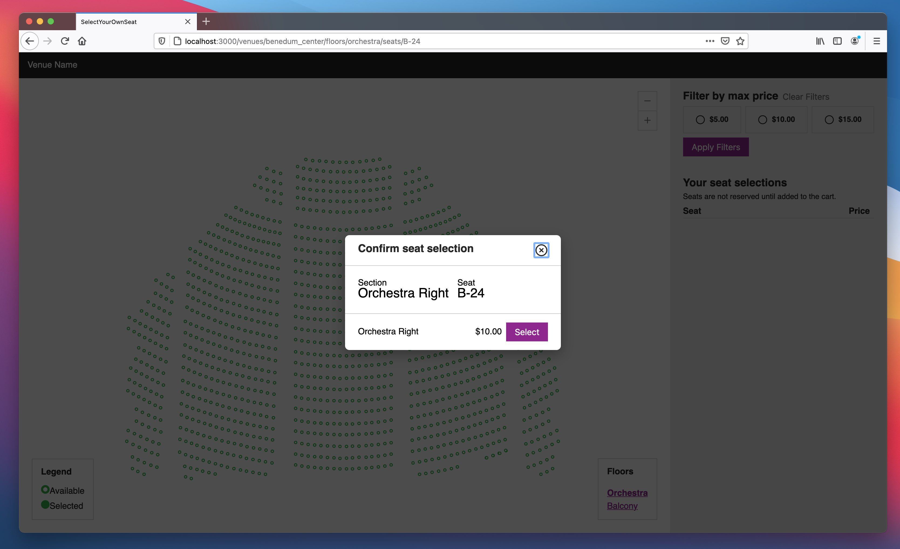

# Demo Application

We have a non-trivial [demo] application built using BreezyJS and the original
[Rails and StimulusJS] version built by the talented [Sean Doyle] The intent is
to help you compare and contrast both approaches and showcase how enjoyable and
Rails-like Breezy/React/Redux can be.

We recommend going over the meticously verbose commit history on [Sean's
version] and comparing that with the [Breezy version].

[demo]: https://github.com/jho406/select-your-own-seat
[Rails and StimulusJS]: https://github.com/seanpdoyle/select-your-own-seat
[Sean Doyle]: https://github.com/seanpdoyle
[Sean's version]: https://github.com/seanpdoyle/select-your-own-seat/commits/main
[Breezy version]: https://github.com/jho406/select-your-own-seat/commits/breezy_019

