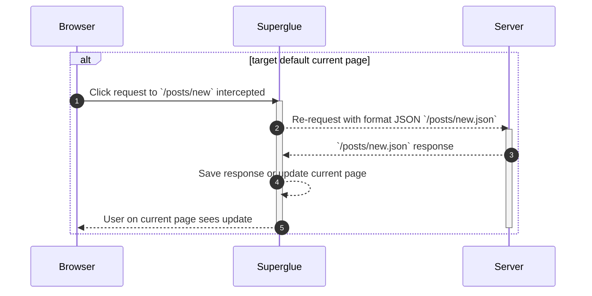

# Requests

When you need more functionality than what UJS offers, Superglue comes with two
functions built around `fetch`, `visit` and `remote`. These are wrapped with
your own implementation in [application_visit.js] and can be accessed via the
NavigationContext.

```js
import { NavigationContext } from '@thoughtbot/superglue';

const { remote, visit } = useContext(NavigationContext)
```

[application_visit.js]: configuration.md#application_visitjs

## visit

`visit` is designed to mimic browser navigation for clicks and
form submissions without the impact of a full page reload. There can be only one
visit at a time and when successful `visit` will swap out the current page
component for the next one.

At glance it looks like this:


!!! hint
    Its possible to modify the visit payload before it saves
    to the store. See the [beforeSave](reference/types.requests.md#visitprops) callback.

<div class="grid cards" markdown>
  -  [:octicons-arrow-right-24: See complete reference](reference/types.requests.md#visit)
     for `visit`
</div>

## remote

Use `remote` when you want to asynchronously update parts of a page or save a
page to the store without swapping the page component or change the browser
history. Unlike visit, you can fire off as many async `remote` requests
as you want.

!!! hint
    Its possible to modify the remote payload before it saves
    to the store. See the [beforeSave](reference/types.requests.md#remoteprops) callback.

By default, `remote` saves or updates the response to the current page that the
user is seeing. At glance it looks like this:



If you provide a `pageKey` you can also target a different page in your store
not visible to the user. Unlike `visit`, `remote` will not derive the target
page key from the response. As long as the componentIdentifier from the
response and target page is the same, `remote` will save and process the response
to the provided `pageKey`.

!!! warning
    The componentIdentifier from the page response **MUST** match the target page, otherwise
    remote will throw a `MismatchedComponentError` error. You can override this by using the
    `force: true` option. See the [docs](reference/types.requests.md#remoteprops)
    for details.


<div class="grid cards" markdown>
  -  [:octicons-arrow-right-24: See complete reference](reference/types.requests.md#remote)
     for `remote`
</div>


!!! tip "Customizations"
    You can modify the behavior of `visit` and `remote` functions globally from
    `application_visit.js`. If you need a global customization, e.g, progress
    bars, you can add them there.

## Differences from UJS

Superglue UJS selectively exposes options of `visit` and `remote` as data
attribute and is architected for forms and links. The `visit` and `remote`
thunks are functions that return promises, allowing for greater flexibility.
