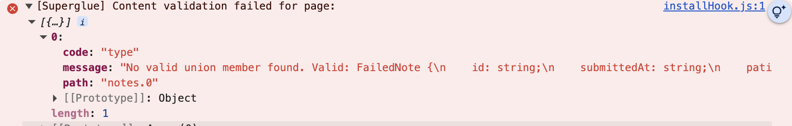

# Working with types

In Superglue, there's no need to annotate your types in ruby just to regenerate
them in typescript. Instead you write **typescript first** and let runtime type
validation give you the developer feedback to build your `.props`.

To get started, run the installation generator with the typescript flag.

```terminal
rails g superglue:install --typescript
```

And make use of the following esbuild plugin, deepkit plugins are also available for vite and bun:

```diff
import * as esbuild from 'esbuild'
import svgr from 'esbuild-plugin-svgr'
+ import { DeepkitLoader } from '@deepkit/type-compiler'
import { readFileSync } from 'fs'
import ts from 'typescript'
import path from 'node:path'

const isWatch = process.argv.includes('--watch')

// Deepkit transformation plugin for tsup/esbuild
const deepkitLoader = new DeepkitLoader()

+ const deepkitPlugin = {
+   name: 'deepkit',
+   setup(build) {
+     const loaderMap = {
+       '.ts': 'ts',
+       '.tsx': 'tsx',
+       '.js': 'js',
+       '.jsx': 'jsx',
+     }
+     build.onLoad({ filter: /\.(tsx?|jsx?)$/ }, async (args) => {
+       if (args.path.includes('node_modules')) {
+         return null
+       }
+ 
+       const source = readFileSync(args.path, 'utf8')
+ 
+       const deepkitTransformed = deepkitLoader.transform(source, args.path)
+ 
+       const ext = path.extname(args.path)
+       const loader = loaderMap[ext] || 'js'
+ 
+       return {
+         contents: deepkitTransformed,
+         loader,
+       }
+     })
+   },
+ }

const buildOptions = {
  entryPoints: [
    'app/javascript/application_superglue.tsx',
    'app/javascript/admin/application.js',
    'app/javascript/application.js',
  ],
  bundle: true,
  sourcemap: true,
  format: 'esm',
  outdir: 'app/assets/builds',
  publicPath: '/assets',
+   plugins:  process.env.NODE_ENV === 'production' ? [svgr()] : [deepkitPlugin, svgr()] ,
  metafile: true,
+  conditions: process.env.NODE_ENV === 'production' ? ['production'] : [],
}

if (isWatch) {
  const ctx = await esbuild.context(buildOptions)
  await ctx.watch()
  console.log('Watching for changes...')
} else {
  const result = await esbuild.build(buildOptions)
  console.log(await esbuild.analyzeMetafile(result.metafile))
}
```

## How It Works

Superglue uses [Deepkit](https://deepkit.io/) for runtime type validation during development:

1. **Build Time**: Deepkit's compiler transforms TypeScript types into runtime validation code
2. **Development Mode**: `useContent()` validates server responses against your types
3. **Production Mode**: Validation code is stripped entirely

## Writing your types

`useContent` is the generic hook used to access the props [you
build](../docs/shaping.md). To make use of runtime types, simply pass a type
describing your page's props as you normally would: 

For example: 

```tsx
  import React from 'react'
  import { useContent } from '@thoughtbot/superglue'

  interface Post {
    id: number
    title: string
    content: string
  }

  type PostShowProps = {
    header: string;
    post: Post;
  }

  export default function PostShow() {
    const { header, post} = useContent<PostShowProps>()

    return (
      <div>
        <h1>{header}</h1>
        
        <ul>
          <li>{post.id}</li>
          <li>{post.title}</li>
          <li>{post.content}</li>
        </ul>
      </div>
    )
  }
```

If the payload from `app/views/posts/show.json.props` was mishaped in anyway, you'd get an error:



Use that error and feedback loop to build your props:

```ruby
json.header "Hello"

json.post do
  json.id 100
  json.title "This is a title"
  json.content "This is a body"
end
```